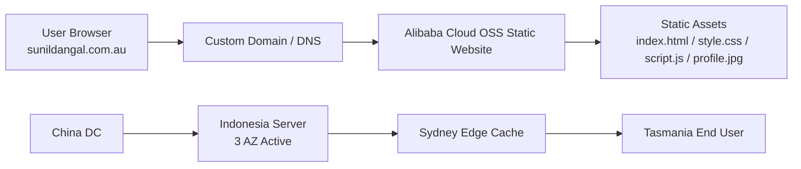

# Sunil Dangal Cloud-Style Portfolio

<p align="center">
  <strong>A cloud-focused static portfolio designed as a live infrastructure-style interface.</strong>
</p>

<p align="center">
  <a href="http://sunildangal.com.au">Live Portfolio</a> •
  <a href="#features">Features</a> •
  <a href="#tech-stack">Tech Stack</a> •
  <a href="#architecture">Architecture</a> •
  <a href="#deployment">Deployment</a>
</p>

<p align="center">
  
  
  
  
</p>

---

## About The Project

This repository contains my cloud-style personal portfolio website, built to present my profile as a future cloud architect and software engineer through an interface inspired by infrastructure diagrams, terminal workflows, and delivery pipelines.

The portfolio is fully static and lightweight, with no framework dependency. It combines a dark architectural visual style, responsive layout behaviour across desktop, iPad, and mobile, an interactive terminal experience, and an AWS SAA quiz mode that can be launched directly from the UI.

Live website:

**http://sunildangal.com.au**

---

## Features

- Cloud-infrastructure-inspired landing experience
- Responsive layout tuned for desktop, tablet, and mobile
- Interactive terminal panel for portfolio navigation
- AWS SAA quiz built into the terminal with scoring and pass/fail result
- Sidebar explorer layout for about, skills, projects, certifications, and contact
- Animated architecture map showing delivery path from China DC to end user
- Static deployment-friendly structure using only HTML, CSS, JavaScript, and image assets

---

## Tech Stack

Built with a focus on simplicity, portability, and static hosting compatibility.

| Layer | Technology | Purpose |
| --- | --- | --- |
| Frontend | HTML5 | Site structure and semantic layout |
| Styling | CSS3 | Custom responsive UI, architecture visuals, dark system theme |
| Interaction | Vanilla JavaScript | Terminal logic, panel switching, quiz engine, motion effects |
| Hosting | Alibaba Cloud OSS Static Website Hosting | Static portfolio delivery |
| Domain | Custom Domain | Live access via `sunildangal.com.au` |
| Assets | JPG, PDF | Profile image and deployment documentation |

---

## Architecture

The portfolio is visually inspired by a cloud delivery map and is intended to represent a static-site delivery flow through a regional architecture path.



### Architecture Notes

- The live UI presents the delivery flow as a visual architecture board rather than a plain hero section.
- The current implementation uses custom CSS and SVG-driven visual elements to simulate a cloud network path.
- Alibaba service naming is reflected in the project structure and presentation.

---

## Interface Highlights

- **Explorer panel:** presents portfolio sections like project files
- **Terminal mode:** lets users inspect information with command-style interaction
- **AWS quiz mode:** includes 20 AWS SAA-style questions, final scoring, and pass/fail logic
- **Architecture board:** frames the cloud path with labelled infrastructure nodes
- **Responsive tuning:** layout remains usable across wide desktop screens, tablets, and compact phones

---

## Project Structure

```text
.
|-- index.html
|-- style.css
|-- script.js
|-- profile.jpg
|-- Alibaba OSS static File Deployment.pdf
`-- README.md
```

---

## Deployment

This site is designed to be deployable as a static website.

### Alibaba Cloud OSS Workflow

1. Upload the static files to your OSS bucket.
2. Enable static website hosting on the bucket.
3. Point your custom domain to the hosted endpoint.
4. Validate routing and asset delivery.

### Local Preview

You can open `index.html` directly in the browser for quick testing, or use a lightweight local server if preferred.

---

## AWS SAA Quiz

The portfolio includes an embedded AWS Solutions Architect Associate practice mode inside the terminal experience.

- 20 multiple-choice questions
- Score shown at the end
- Pass mark: **17/20**
- If the score is below 17, the result is fail and encourages another attempt

This was added to make the portfolio not only visual, but also useful as a personal revision tool.

---

## Notes

- This project is intentionally framework-free.
- The design prioritises clarity, responsiveness, and visual identity.
- The interface is styled to communicate cloud architecture ambition and static delivery knowledge to recruiters and employers.

---

## Author

**Sunil Dangal**

- Website: http://sunildangal.com.au
- LinkedIn: https://www.linkedin.com/in/sunildangal/
- GitHub: https://github.com/lagnadlinus

